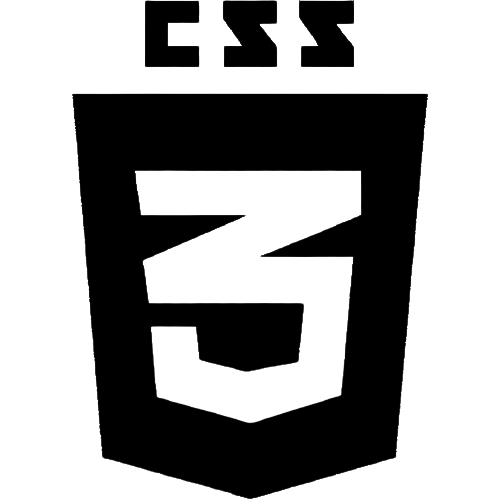

   Hi, my name is **Catrin Mentzoni**!
   ===================================
 
 ---------------------------------------------------------------------------------------------------------------

**Skills:**
-----------

    
    
    

About me:
---------

* I am an enthusiastic and friendly individual with excellent communication and listening skills, 
who thrives when working as part of a team.

* I love learning new things, and I also love a challenge!

* I am an independent, resourceful self-starter that can organise projects from start to finish, 
and ensure that they are completed to a very high standard.

* I have a good understanding of business, management and marketing - 
having studied business for 7 years and run my own events business.

*I have a good understanding of how dev projects are organised, having worked as an account executive/project manager for [Brew Digital](https://www.wearebrew.co.uk/digital-marketing-agency-for-hospitality/) 
between 2022 - 2023 where I was responsible for independently organising for full web builds.

Fun facts:
----------

* I previously worked as a primary school teacher for ten years.

* I have two daughters aged 3 and 8.

* I play guitar and bass guitar.

* I am a MASSIVE music fan. I love everything from Alan Lomax's early recordings, to heavy metal, pop, northern soul, acid house, punk and post-punk and everything in between!

* I love to travel.

* I am very creative, and love art, graphic design and fashion.

**Please send me a message on [LinkedIn](https://www.linkedin.com/in/catrin-mentzoni-9387b6224/)**
---------------------------------------------------------------------

<!-- 

 -->
